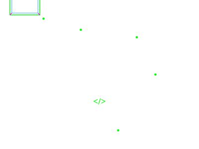

# 👋 Hi, I'm Rohan Lal

Full-Stack Developer passionate about building amazing web applications and solving real-world problems with code.

---

## 🎨 3D Interactive Visualization

<p align="center">
  
</p>

---

## 🚀 About Me

```python
class FullStackDeveloper:
    def __init__(self):
        self.name = "Rohan Lal"
        self.role = "Full-Stack Developer & Real-Time System Architect"
        self.stack = ["JavaScript", "React", "Node.js", "Express", "MongoDB", "WebRTC"]
        self.passion = ["AI SaaS Integrations", "Real-Time Systems", "Creative UI/UX"]

    def say_hi(self):
        print("Transforming complex ideas into responsive, intelligent products! 🚀")

me = FullStackDeveloper()
me.say_hi()
```

- 🔭 Currently building **AI-driven SaaS Platforms & P2P Real-Time Applications**
- 🌱 Mastering **TypeScript, GraphQL, & Advanced Cloud Deployments**
- 👯 Looking to collaborate on **Open Source AI & WebRTC/Socket.io Tooling**
- 💬 Ask me about **MERN stack, WebRTC, TailwindCSS v4, & Graph Pathfinding**
- ⚡ Fun fact: **I debug in my sleep, compile ideas in my coffee, and code for performance!** ☕

---

## 🏆 GitHub Trophies

<p align="center">
  <a href="https://github.com/ryo-ma/github-profile-trophy"></a>
</p>

---

## 💻 Tech Stack

**Languages:** JavaScript | C | SQL | HTML5 | CSS3

**Frontend:** React | Redux Toolkit | TailwindCSS v4 | Framer Motion | Vite

**Backend:** Node.js | Express.js | MongoDB | Firebase

**Real-Time & AI:** WebRTC | Socket.io | Gemini AI / OpenRouter

**Tools:** Cloudinary | Git | Postman | Discord.js

---

## 📌 Featured Projects

🌐 **AI Website Builder** - Full-stack SaaS platform generating websites from prompts with Monaco Editor & Firebase  
📸 **Instagram Clone** - Social network with real-time messaging, notifications, and Cloudinary storage  
🚌 **BusFinder Router** - Pathfinding app optimizing routes between stops using BFS graph traversal  
📞 **WebRTC Video Chat** - Real-time video/audio calling application with Socket.io signaling  
📄 **AI Resume Builder** - Intelligent resume builder using Google Gemini AI  
🎯 **Blog Application** - Full-stack blogging platform with MongoDB & Express  
🍕 **Food App** - Restaurant ordering system with real-time updates  
💬 **Chat Application** - Real-time messaging with Socket.io & clustering  
🤖 **Discord Bot** - Custom Discord bot with command system  
📈 **Retail Sales Analysis** - SQL data analysis & reporting  
🎨 **Portfolio Website** - React + Vite + TailwindCSS  

---

## 📊 GitHub Stats

<p align="center">
  
</p>

<p align="center">
  
</p>

---

## 🐍 Contribution Graph

<p align="center">
  
</p>

---

## 🌱 Currently Learning

- TypeScript for Large-Scale Applications
- GraphQL & Advanced Database Design
- Cloud Deployment (AWS, Vercel)
- React Performance Optimization

---

## 📫 Let's Connect

<p align="center">
  <a href="https://linkedin.com"></a>
  <a href="mailto:your.email@gmail.com"></a>
  <a href="https://yourportfolio.com"></a>
</p>

---

<p align="center"><strong>Made with ❤️ by Rohan Lal</strong></p>

<p align="center">⭐ Feel free to explore my repositories and connect with me!</p>
